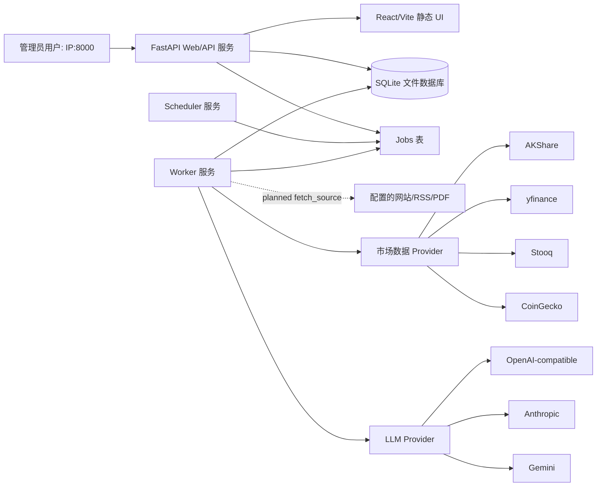
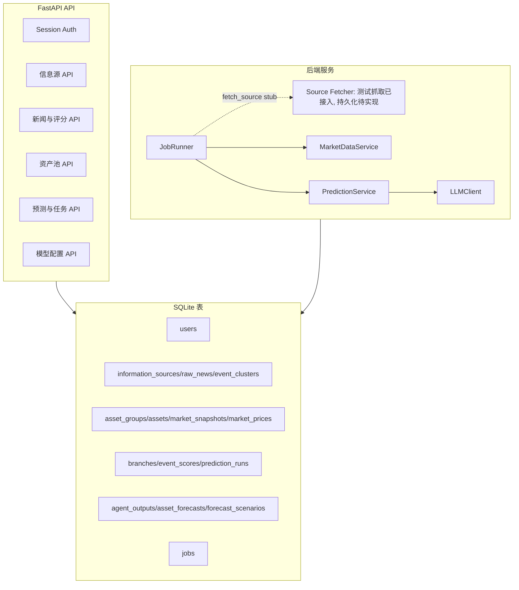
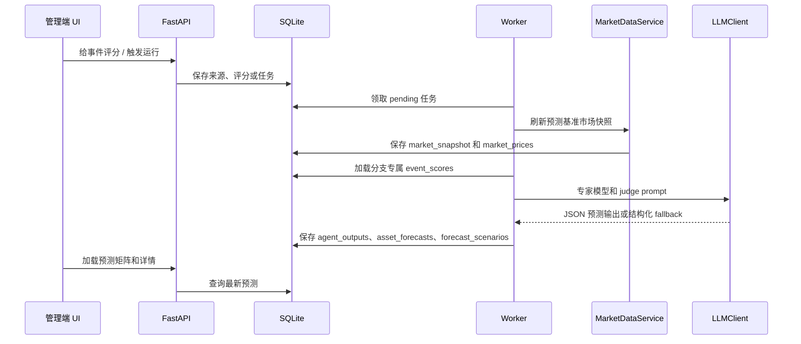
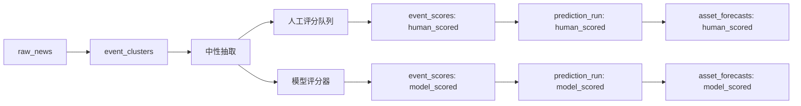

# 架构

Asset Worldline Agent 是一个用于跨资产情景预测的私有研究仪表盘。它不是自动交易系统。

## 当前实现状态

已经实现：

- 管理员 session 登录。
- 信息源 CRUD 和测试抓取。
- 数据库 schema，覆盖原始新闻、事件簇、分支评分、市场快照、模型输出和预测。
- 通过 AKShare、yfinance、Stooq、CoinGecko fallback 路径执行市场快照任务。
- LLM provider 调用，并在不可用时生成结构化 fallback 输出。
- 针对 `human_scored` 与 `model_scored` 的分支隔离预测运行。
- 预测矩阵和系统任务 UI。

尚未接入：

- 从已配置来源定时抓取并持久化文章。
- 原始新闻去重和事件聚类任务。
- PDF 持久化与完整抽取流水线。
- 更丰富的信息源健康度仪表盘。

下面的图展示的是目标架构。上面标记为尚未接入的组件，当前可能只具备 schema、UI 或测试抓取脚手架，还不是完整的生产级入库流程。

## 系统图

## 运行时服务

生产部署使用三个 systemd 服务：

| 服务 | 入口 | 用途 |
|---|---|---|
| `asset-worldline-web.service` | `uvicorn app.main:app` | 提供 API、session 和构建后的前端静态资源。 |
| `asset-worldline-worker.service` | `python -m app.workers.worker` | 执行队列任务。市场快照和预测运行已经接入；source fetch 仍是 stub。 |
| `asset-worldline-scheduler.service` | `python -m app.workers.scheduler` | 为计划中的入库流水线创建周期性 source-fetch 任务。 |

SQLite 文件保存所有持久状态，默认路径是 `/var/lib/asset-worldline/asset-worldline.db`。FastAPI 直接监听 `0.0.0.0:8000`，通过 `http://服务器IP:8000` 访问。

## 核心组件

## 预测数据流

## 分支隔离

系统有两条固定分支：

- `human_scored`：只有人工评分且 `importance > 0` 的事件簇可以进入预测。
- `model_scored`：事件簇由模型评分器自动评分。

共享数据：

- 原始新闻。
- 事件簇。
- 中性摘要和实体。
- 资产池。
- 市场快照。
- 信息源元数据。

分支专属数据：

- `event_scores`。
- `prediction_runs`。
- `agent_outputs`。
- `asset_forecasts`。
- `forecast_scenarios`。
- `forecast_evaluations`。

每张分支专属表都直接携带 `branch_id`，或通过 `prediction_run_id` 关联到分支。

## 预测流程

`PredictionService` 分四个阶段运行预测：

1. 确保存在近期市场快照。
2. 对 `model_scored` 分支创建缺失的自动事件评分。
3. 运行三个专家角色：
   - `macro_asset_model`
   - `industry_sector_model`
   - `market_trading_model`
4. 运行 `judge_aggregator` 并持久化最终预测。

如果 provider 被禁用、缺少 API key 或返回无效 JSON，`LLMClient` 会保存结构化 fallback 响应，而不是让整次任务失败。这可以保持任务可审计，也能在生产模型 key 配置前先验证 UI 流程。

## 市场数据

`MarketDataService` 按以下顺序尝试免费 provider：

- 中国/香港资产：优先 AKShare，然后 fallback 到 yfinance/Stooq。
- 美国/全球资产：优先 yfinance，然后 fallback 到 Stooq。
- 加密资产：优先 CoinGecko。

每条 `market_price` 保存：

- 价格和币种。
- `as_of` 时间戳。
- Provider 来源。
- 抓取状态。
- 可用时保存近期收益、3 个月高低点、波动率等历史特征。

## 前端

当前 React/Vite 前端提供：

- 登录。
- Overview。
- 信息源和测试抓取。
- News pool。
- 人工评分。
- 资产池。
- 预测矩阵。
- 模型配置。
- 系统任务和手动市场快照触发。

生产环境构建前端后，FastAPI 会提供 `frontend/dist` 静态资源。
