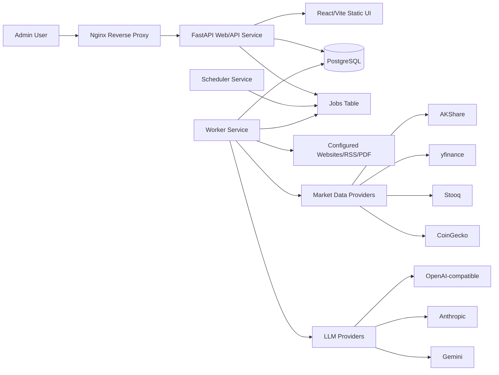
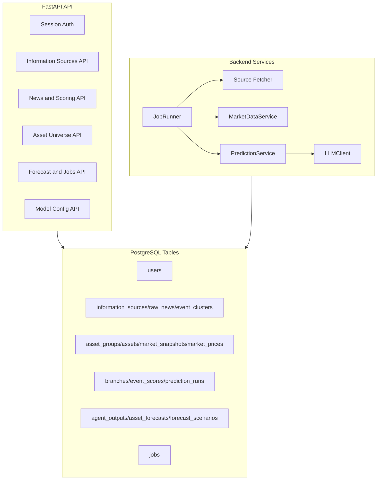
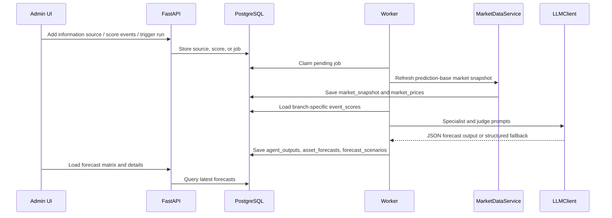
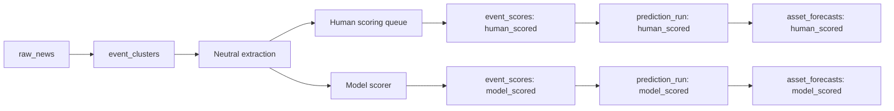

# Architecture

Asset Worldline Agent is a private research dashboard for cross-asset scenario forecasting. It is not an automated trading system.

## System Diagram

## Runtime Services

The production deployment uses three systemd services:

| Service | Entry Point | Purpose |
|---|---|---|
| `asset-worldline-web.service` | `uvicorn app.main:app` | Serves API, sessions, and built frontend assets. |
| `asset-worldline-worker.service` | `python -m app.workers.worker` | Executes queued jobs: market snapshots and prediction runs. |
| `asset-worldline-scheduler.service` | `python -m app.workers.scheduler` | Enqueues recurring source-fetch jobs. |

PostgreSQL stores all durable state. Nginx proxies public traffic to FastAPI on `127.0.0.1:8000`.

## Core Components

## Data Flow

## Branch Isolation

There are two fixed branches:

- `human_scored`: only manually scored event clusters with `importance > 0` enter forecasts.
- `model_scored`: event clusters are scored automatically by the model scorer.

Shared data:

- Raw news.
- Event clusters.
- Neutral summaries and entities.
- Asset universe.
- Market snapshots.
- Source metadata.

Branch-specific data:

- `event_scores`.
- `prediction_runs`.
- `agent_outputs`.
- `asset_forecasts`.
- `forecast_scenarios`.
- `forecast_evaluations`.

Every branch-specific table carries `branch_id` directly or through `prediction_run_id`.

## Forecast Workflow

`PredictionService` runs forecasts in four phases:

1. Ensure a recent market snapshot exists.
2. For `model_scored`, create missing automatic event scores.
3. Run three specialist roles:
   - `macro_asset_model`
   - `industry_sector_model`
   - `market_trading_model`
4. Run `judge_aggregator` and persist final forecasts.

If a provider is disabled, missing an API key, or returns invalid JSON, `LLMClient` stores a structured fallback response instead of failing the whole run. This keeps the job auditable and lets UI flows work before production model keys are configured.

## Market Data

`MarketDataService` attempts free providers in this order:

- CN/HK assets: AKShare first, then yfinance/Stooq fallback.
- US/global assets: yfinance first, then Stooq fallback.
- Crypto assets: CoinGecko first.

Each `market_price` stores:

- Price and currency.
- `as_of` timestamp.
- Provider source.
- Fetch status.
- Historical features such as recent returns, 3-month high/low, and volatility where available.

## Frontend

The React/Vite frontend currently exposes:

- Login.
- Overview.
- Information sources and test fetch.
- News pool.
- Human scoring.
- Asset universe.
- Forecast matrix.
- Model configuration.
- System jobs and manual market snapshot trigger.

FastAPI serves `frontend/dist` in production when the frontend is built.

